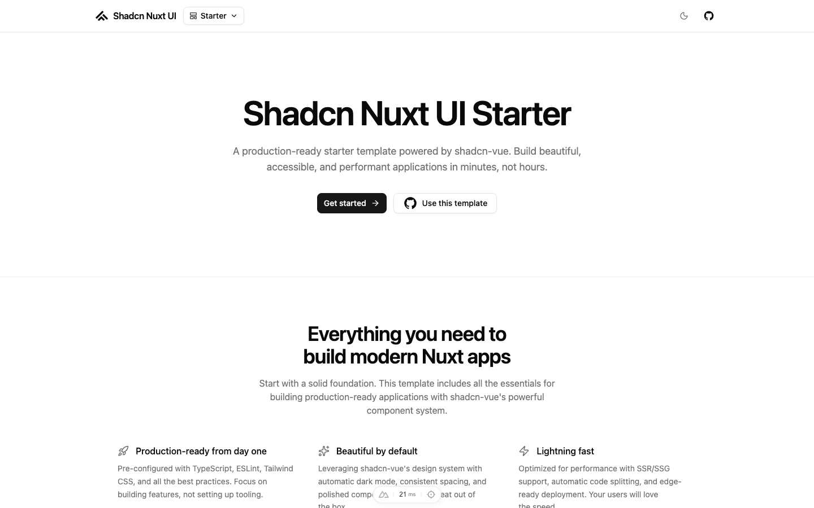

# Shadcn Nuxt UI Starter

[](https://nuxt.com)

Use this template to get started quickly with Nuxt 4, shadcn-vue, and Tailwind CSS v4.

- [Live demo](https://shadcn-nuxt-ui-starter.stackhacker.io/)
- [Documentation](https://shadcn-nuxt-ui.stackhacker.io/docs/getting-started)

<a href="https://shadcn-nuxt-ui-starter.stackhacker.io/" target="_blank">
  <picture>
    <source media="(prefers-color-scheme: dark)" srcset="public/screenshots/starter-dark.png">
    <source media="(prefers-color-scheme: light)" srcset="public/screenshots/starter-light.png">
    
  </picture>
</a>

## Quick Start

```bash
npx nuxi@latest init my-app
cd my-app
pnpm add shadcn-nuxt
```

## Deploy your own

Clone this repository and deploy to your preferred platform.

## Setup

Make sure to install dependencies:

```bash
pnpm install
```

## Development Server

Start the development server on `http://localhost:3000`:

```bash
pnpm dev
```

## Lint

```bash
pnpm lint
```

## Typecheck

```bash
pnpm typecheck
```

## Production

Build the application for production:

```bash
pnpm build
```

Locally preview production build:

```bash
pnpm preview
```

Check the [Nuxt deployment documentation](https://nuxt.com/docs/getting-started/deployment) for more details.

## Renovate integration

Install the [Renovate GitHub app](https://github.com/apps/renovate/installations/select_target) on your repository.
